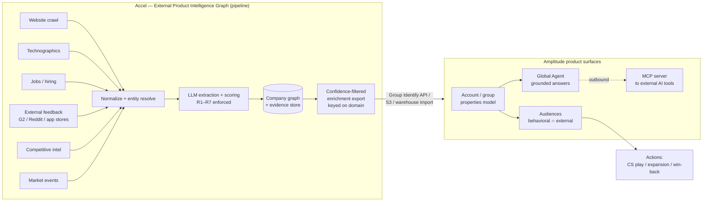

# Integration Architecture — How the Dataset Lands Inside Amplitude

**Product:** External Product Intelligence Graph · **Buyer:** Amplitude · **Date:** 2026-05-21

> **Load-bearing technical finding (verified against Amplitude docs).** Amplitude's **MCP server is outbound** — it exposes Amplitude's behavioral data *to* external AI tools ([docs](https://amplitude.com/docs/analytics/amplitude-mcp)); it is **not** a documented path to feed an external dataset *into* the agents. The inbound path for account-level external signals is the **Group Identify API** (write group/account properties) plus warehouse/S3 import for backfill ([Group Identify](https://amplitude.com/docs/apis/analytics/group-identify), [S3](https://amplitude.com/docs/data/source-catalog/amazon-s3)). Once landed as account (group) properties, the data becomes part of Amplitude's semantic model that the **Global Agent** reads — and can then be surfaced back outward via MCP. The three shapes below are built on that fact.
>
> Two items to confirm with Amplitude before contracting: (1) Amplitude does **not** document an automatic join on company *domain* — accounts are associated via `group_type`/`group_value` assignment or integration schema mapping, so the join key is the customer's account/group identifier (commonly, but not guaranteed to be, domain). (2) Whether cohorts can be **triggered directly off group/account properties** is not confirmed in the Audiences overview; account-level *reporting* on group properties is documented.

## Shape 1 — Account properties enrichment

**Description.** Accel delivers a per-company enrichment record that populates Amplitude's **account (group) model** with external signals — feedback pain themes, competitive-pressure score, recent product launches, technographic stack, hiring signals, and the Amplitude-fit scores. The customer maps Accel's `domain` to their Amplitude `group_value`; Accel writes the properties via the Group Identify API (or warehouse/S3 sync for bulk/backfill). A PM viewing an account in Amplitude now sees market context next to product usage.

**Data contract.**
- **Join key:** `company_domain` → customer's Amplitude `group_value` (group_type e.g. `account`/`organization_id`). Confirm domain-keying per customer.
- **Write path:** `POST /groupidentify` with `group_type`, `group_value`, `group_properties` (`$set`). Bulk/backfill via S3 or BigQuery group-property import.
- **Cadence:** monthly for technographics/firmographics; weekly for feedback/market-event-derived properties.
- **Payload (illustrative):** `{ "external_feedback_pain_score": 78, "competitive_pressure_score": 64, "recent_product_launch_90d": true, "detected_product_analytics_tools": ["mixpanel"], "overall_amplitude_fit_score": 81, "_evidence_ref": "evidence://acme/2026-05" }`
- **Rules:** every property below confidence 0.6 is omitted (R1); each carries an evidence reference.

**User-facing benefit.** A product manager or CS lead sees *why* an account's in-product behavior is changing — emerging public pain, a competitor's pressure, a recent launch — without leaving Amplitude.

## Shape 2 — Audience triggers

**Description.** External signal patterns become **audience definitions**: e.g., *complaint volume spiked (external_feedback_pain_score rose) **and** product usage dropped (Amplitude behavioral cohort)*. The behavioral leg is native Amplitude; the external leg is an Accel-written account property. The combination produces a cohort of at-risk or expansion-ready accounts that can be synced to a destination (Slack, CRM, Braze) and actioned.

**Data contract.**
- **Inputs:** Amplitude behavioral cohort (native) ∩ Accel account properties (Shape 1).
- **Trigger example:** `external_feedback_pain_score >= 70` AND behavioral cohort `weekly_active_drop_20pct`.
- **Sync:** on-demand / automated (hourly–daily) / real-time via Audiences ([docs](https://amplitude.com/docs/data/audiences)).
- **Dependency / risk:** requires that Amplitude cohorts can condition on group/account properties — **confirm with Amplitude** (see top note). If only user-level properties are supported in the cohort builder today, the account property is fanned out to member users as a fallback.

**User-facing benefit.** Teams move from reactive to proactive: a churn-risk or expansion audience assembles itself the moment external pain or buying signals appear, and triggers the next play automatically.

## Shape 3 — AI Agent context (Global Agent)

**Description.** Because Accel's signals live in Amplitude's semantic model as account properties (Shape 1), the **Global Agent** can read and cite them when answering customer-health and expansion questions — grounded in evidence, not the model's priors. The agent can now answer questions whose answer lives *outside* the customer's event stream.

**Data contract.**
- **Mechanism:** no new agent integration required — the Global Agent already reads project data ([docs](https://amplitude.com/docs/amplitude-ai/global-agent-overview)); Accel data enters as group properties (Shape 1).
- **Example —** *Prompt:* "Which of my enterprise accounts show rising external pain this quarter, and why?" *Answer the agent can now produce:* "Three accounts. Acme's `external_feedback_pain_score` rose 22 points; evidence: 14 new G2 reviews citing missing integrations (source URLs, dated). Globex shows competitor-displacement language in reviews and removed a competitor from its integrations page."
- **Outbound reuse:** the same enriched account data is exposable to external AI tools via Amplitude's MCP server.

**User-facing benefit.** The agent stops saying "usage dropped" and starts saying "usage dropped *because* external pain is rising — here's the evidence and the recommended play."

## Architecture diagram

*Flow: Accel's pipeline produces a confidence-filtered, evidence-referenced enrichment file keyed on company domain → written to Amplitude as account/group properties via the Group Identify API (or S3/warehouse for bulk) → consumed by the account model, Audiences, and the Global Agent. MCP is shown as an outbound reuse path, not an inbound one.*
